# Practice Azure Key Valut

----------------------------------------------------------------
## Process:
##### -We started session in [Azure](https://www.portal.azure.com)
##### -We search key valuts and click on it.
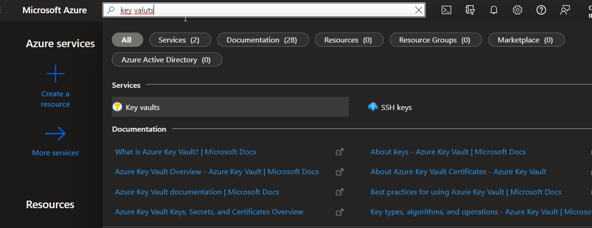
##### -Click on create, or create key valut.
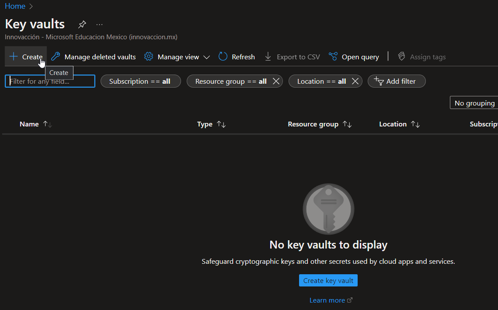
##### -On basics section, select a region, set a name, and chose a resource group, or you can create a new one.
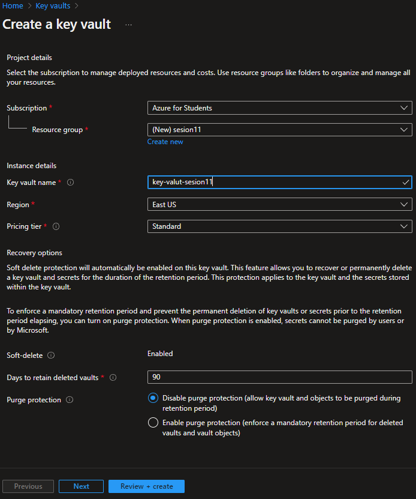
##### -On access policy, enable the three options.
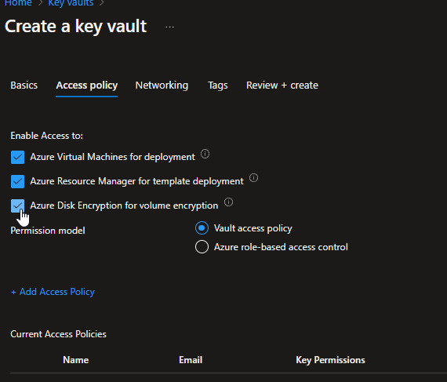
##### -Click on review and create.
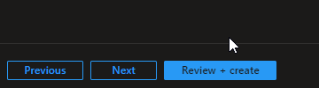
##### -Go to resource.
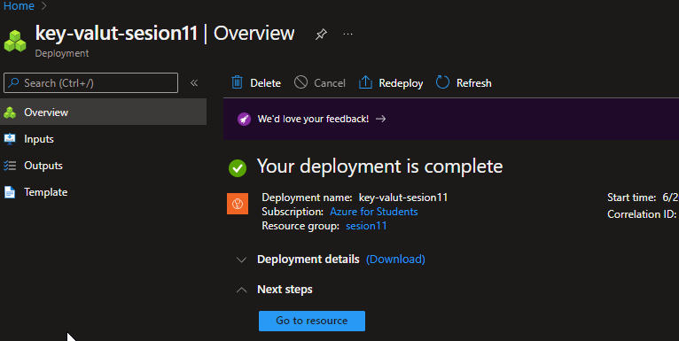
##### -Go to settings section, and click on secrets.
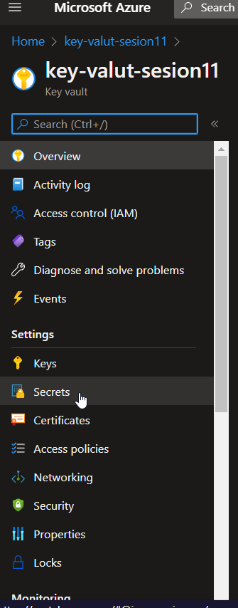
##### -Click on generate.
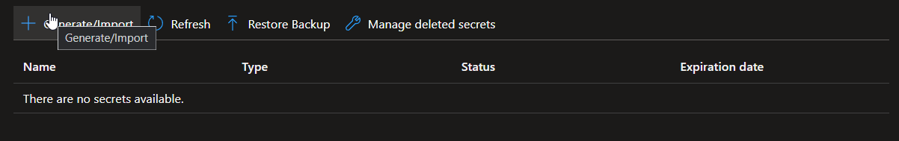
##### -Now you can save your passwords.
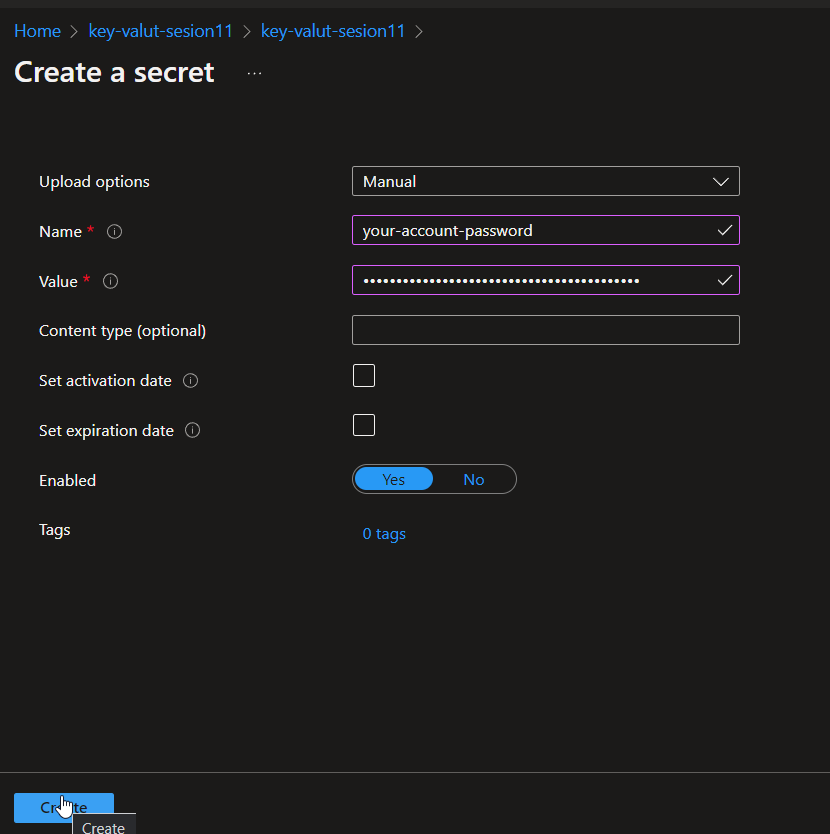
##### -Click on your password created.
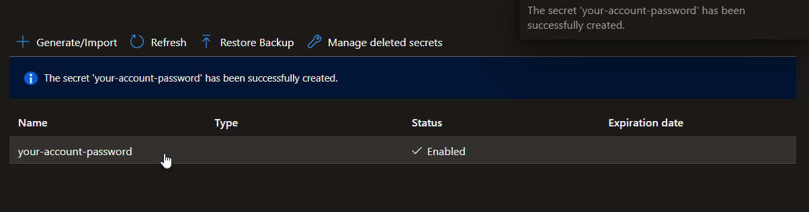
##### -Now, you can handle your password.
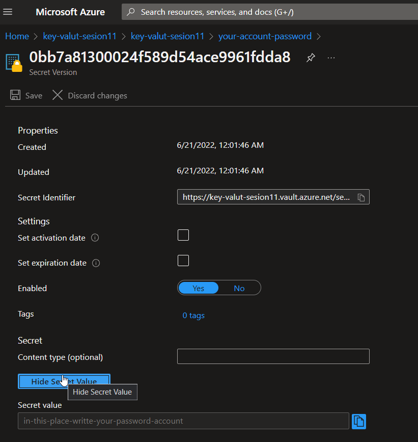
## 🔥🔥Congratulations! you created a key valut. 🔥🔥